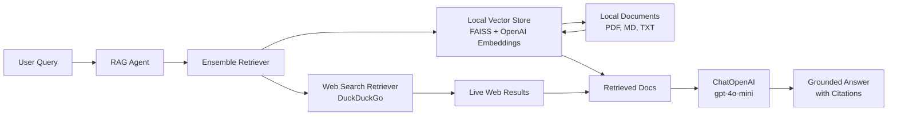

# RAG Pipeline Implementation Plan

## Overview

Build a Retrieval-Augmented Generation (RAG) pipeline that combines local document retrieval with live web search to provide grounded, cited answers.

## Architecture



## Components

### 1. Document Loader (`src/document_loader.py`)
- **Purpose**: Load local documents (PDF, Markdown, TXT)
- **Classes/Functions**:
  - `DocumentLoader` class with methods for each file type
  - `load_pdf(file_path)` - uses PyPDFLoader
  - `load_markdown(file_path)` - uses UnstructuredMarkdownLoader
  - `load_text(file_path)` - uses TextLoader
  - `load_directory(directory_path)` - loads all supported files

### 2. Vector Store (`src/vector_store.py`)
- **Purpose**: Create and manage FAISS vector store with OpenAI embeddings
- **Classes/Functions**:
  - `VectorStoreManager` class
  - `create_vector_store(documents)` - creates FAISS index
  - `load_vector_store(path)` - loads existing index
  - `save_vector_store(path)` - persists index to disk
  - `as_retriever()` - returns retriever interface

### 3. Web Retriever (`src/web_retriever.py`)
- **Purpose**: Search live web using DuckDuckGo
- **Classes/Functions**:
  - `DuckDuckGoRetriever` class (subclasses `BaseRetriever`)
  - Returns LangChain `Document` objects with metadata (URL, title)
  - `get_relevant_documents(query)` - main retrieval method

### 4. Ensemble Retriever (`src/ensemble_retriever.py`)
- **Purpose**: Combine local and web retrievers with weighted scoring
- **Classes/Functions**:
  - `create_ensemble_retriever(local_retriever, web_retriever, weights=[0.7, 0.3])`
  - Uses `EnsembleRetriever` from langchain

### 5. RAG Chain (`src/rag_chain.py`)
- **Purpose**: Orchestrate retrieval + LLM generation
- **Classes/Functions**:
  - `RAGChain` class
  - `create_chain(retriever)` - creates RetrievalQA chain
  - `ask(query)` - main interface returning answer + sources

### 6. RAG Agent (`rag_agent.py`)
- **Purpose**: CLI interface for the RAG system
- **Features**:
  - `ask(query)` function for interactive queries
  - Logging of retrieved documents
  - Caching layer for repeated queries
  - Pretty-printed results with citations

## File Structure

```
rag-websearch/
├── .venv/                              # Virtual environment
├── .env                                # API keys
│                                         #   OPENAI_API_KEY=sk-...
├── docs/                               # Local documents for RAG
│   ├── langchain_guide.md
│   ├── vscode_tips.md
│   └── sample.txt
├── src/
│   ├── __init__.py
│   ├── document_loader.py              # Document loading utilities
│   ├── vector_store.py                 # FAISS vector store management
│   ├── web_retriever.py                # DuckDuckGo web search
│   ├── ensemble_retriever.py           # Combining retrievers
│   └── rag_chain.py                    # RAG chain creation
├── rag_agent.py                        # Main CLI entry point
├── tests/
│   └── test_rag.py                     # Unit tests
├── requirements.txt                    # Python dependencies
└── plans/
    └── rag-pipeline-implementation-plan.md
```

## Dependencies (`requirements.txt`)

```
langchain>=0.1.0
langchain-openai>=0.0.5
langchain-community>=0.0.10
langchain-text-splitters>=0.0.1
faiss-cpu>=1.7.4
openai>=1.10.0
python-dotenv>=1.0.0
duckduckgo-search>=4.1.0
pypdf>=3.17.0
unstructured>=0.11.0
tiktoken>=0.5.0
```

## Configuration

### Environment Variables (`.env`)
```env
OPENAI_API_KEY=sk-your-openai-key-here
```

## Implementation Details

### Document Loading Strategy
1. Use `PyPDFLoader` for PDF files
2. Use `UnstructuredMarkdownLoader` for Markdown
3. Use `TextLoader` for plain text files
4. Split documents into chunks (default: 1000 chars, 200 char overlap)
5. Store metadata: source file, page number (if applicable)

### Vector Store Configuration
- Embedding model: `text-embedding-3-small` (OpenAI)
- Index type: FAISS (in-memory, savable to disk)
- Similarity: Cosine similarity

### Web Search Configuration
- Provider: DuckDuckGo (no API key required)
- Results: Top 5 results per query
- Snippet length: First 500 chars of description

### Ensemble Configuration
- Local weight: 0.7 (70%)
- Web weight: 0.3 (30%)
- Method: Weighted score combination

### LLM Configuration
- Model: `gpt-4o-mini` (cost-effective, fast)
- Temperature: 0 (factual responses)
- Max tokens: 1000

## Features

### Logging
- Log all queries and retrieved documents
- Store in `logs/rag_agent.log`
- Include: timestamp, query, sources, answer

### Caching
- Cache query results for 1 hour
- Use in-memory cache (dict-based)
- Key: hash of normalized query

## Usage

### Basic Usage
```python
from rag_agent import ask

# Ask a question
result = ask("What is LangChain?")
print(result["answer"])
print(result["sources"])
```

### CLI Mode
```bash
python rag_agent.py
# Enter query when prompted
```

### Example Queries
1. "Summarize LangChain RAG docs"
2. "Latest VS Code RAG tutorials"
3. "Compare GPT-4o mini vs GPT-3.5"

## Execution Order

1. **Setup Phase**
   - [ ] Install dependencies
   - [ ] Create .env file
   - [ ] Add sample documents to docs/

2. **Implementation Phase**
   - [ ] Implement document_loader.py
   - [ ] Implement vector_store.py
   - [ ] Implement web_retriever.py
   - [ ] Implement ensemble_retriever.py
   - [ ] Implement rag_chain.py
   - [ ] Implement rag_agent.py

3. **Testing Phase**
   - [ ] Test with sample queries
   - [ ] Verify citations
   - [ ] Check logging output

## Notes

- DuckDuckGo is used as the web search provider (free, no API key)
- OpenAI API key is still required for embeddings and LLM
- All local files are relative to project root
- Virtual environment uses Python 3.10+